# 📇 Contact Manager SaaS

> A modern, premium Customer Relationship Management (CRM) directory for seamlessly managing contacts, leads, categories, and professional relationships.

[]()
[]()
[]()
[]()
[]()
[]()
[]()

## 📖 Project Overview

Contact Manager is a full-stack, enterprise-ready application designed to streamline how professionals and businesses manage their network. Built with a focus on a **sleek, high-contrast visual design**, lightning-fast performance, and exceptional user experience, it offers robust authentication, advanced contact filtering, CSV import/export capabilities, and a fully responsive layout.

## ✨ Features

- 🔐 **Secure JWT Authentication:** Stateless token-based auth with access and refresh tokens.
- 👤 **User Profiles with Avatar Upload:** Custom profile management supporting image uploads and secure credential updates.
- 📇 **Complete Contact Management (CRUD):** Full create, read, update, and delete capabilities with duplicate phone/email protection.
- 🏷 **Category Management:** Organize contacts dynamically using custom tags and groups.
- ⭐ **Favorite Contacts:** Quickly star and filter your most important network connections.
- 🔍 **Instant Search:** Real-time query matching across names, emails, companies, and phone numbers.
- 🎯 **Category & Favorite Filters:** Granular filtering options to sort through your directory effortlessly.
- 📄 **CSV Import & Export:** Bulk data portability supporting seamless migration and backup.
- 📈 **Dashboard Analytics:** Aggregated insights tracking total counts, favorites, and recent activity metrics.
- 🌙 **Light & Dark Mode:** Fully persistent theme switching with customized design tokens.
- 📱 **Fully Responsive Design:** Optimized layouts providing a native-like experience across mobile, tablet, and desktop viewports.
- 🔒 **Password Reset via Email:** Secure tokenized workflows for seamless account recovery.
- 📦 **Robust Logging & Error Handling:** Winston-powered backend logging with Morgan HTTP request tracking and structured JSON error responses.
- 🛡️ **Advanced Rate Limiting:** Tiered IP-based rate limiting via `express-rate-limit` to protect authentication and API endpoints against brute-force and DoS attacks.
---

## 🛠️ Technology Stack

| Technology | Purpose / Implementation in Project |
|------------|---------|
| **React 18** | Core frontend UI library utilizing functional components and custom hooks. |
| **TypeScript** | End-to-end type safety for props, state, API responses, and database schemas. |
| **Vite** | Next-generation frontend build tool for instant server start and HMR. |
| **Tailwind CSS** | Utility-first styling powering the custom CSS variables and semantic design tokens. |
| **Zustand** | Lightweight, scalable global state management (`authStore`, `contactStore`, `categoryStore`). |
| **React Router** | Client-side routing with specialized `<ProtectedRoute />` and `<PublicRoute />` wrappers. |
| **Axios** | HTTP client handling API requests, automatic token injection, and response error formatting. |
| **React Hot Toast** | Notification engine wrapped in a custom semantic utility (`showToast.tsx`) for native dark-mode support. |
| **Lucide React** | Clean, consistent, and customizable SVG iconography across the UI shell. |
| **Node.js & Express** | High-performance backend API serving secure RESTful endpoints. |
| **MongoDB / Mongoose** | NoSQL database for flexible data modeling, validation schemas, and relationship indexing. |
| **JWT (jsonwebtoken)** | Secure, stateless authentication via short-lived access tokens and refresh tokens. |
| **Winston & Morgan** | Production-grade logging system capturing stack traces, error contexts, and real-time HTTP request performance. |
| **Express Rate Limit** | IP-based request throttling protecting authentication and general API endpoints from brute-force and flood attacks. |

## 🏗️ Architecture & Technical Documentation

### Frontend Architecture
* **Component-Based Design:** UI elements are strictly segregated into reusable primitives (`src/components/ui/`) and feature-specific components (`src/components/contacts/`).
* **State Management:** Global state is handled exclusively via **Zustand**. Business logic, API calls, and loading states are encapsulated within stores (`authStore`, `contactStore`, `categoryStore`), keeping React components incredibly clean and declarative.
* **Routing Structure:** Implemented via `react-router-dom`. The `AppRoutes.tsx` acts as the traffic controller, wrapping sensitive routes in a `<ProtectedRoute />` that verifies JWT validity before rendering.
* **API / Service Layer:** All external HTTP requests pass through `src/services/api.ts`. This centralized Axios instance automatically intercepts requests to attach Authorization headers and standardizes error handling.

### Visual Design & Theme System
* **Premium Design System:** Built on a "Sleek Zinc & Indigo" aesthetic, mirroring top-tier modern SaaS platforms.
* **Theme System:** Managed by `ThemeContext.tsx`, which persists user preference to `localStorage` and toggles a `.dark` class directly on the `<html>` root node.
* **Semantic CSS Variables:** `index.css` defines strict semantic color tokens (`--color-surface`, `--color-text`, `--color-brand-500`) that automatically swap hex codes based on the active theme mode.
* **Custom Notification Engine:** Uses `react-hot-toast` heavily customized via `showToast.tsx` to inject semantic CSS variables dynamically, ensuring toasts perfectly match the active Light/Dark theme.

## 🚀 Getting Started

### Prerequisites
Ensure you have the following installed on your local machine:
* **Node.js** (v18.0.0 or higher)
* **npm** or **yarn**
* **MongoDB** (Local instance or MongoDB Atlas URI)

## Installation

### 1. Clone the repository

```bash
git clone https://github.com/neumann111/contact-manager-saas.git
cd contact-manager-saas
```

### 2. Backend Setup

```bash
cd backend
npm install
```

Create a `.env` file inside `backend`:

```env
PORT=5000
MONGODB_URI=mongodb://localhost:27017/contact_manager
JWT_SECRET=your_super_secret_jwt_key
JWT_EXPIRES_IN=7d
```

Start the backend:

```bash
npm run dev
```

### 3. Frontend Setup

Open another terminal:

```bash
cd frontend
npm install
```

Create a `.env` file inside `frontend`:

```env
VITE_API_URL=http://localhost:5000/api
```

Start the frontend:

```bash
npm run dev
```

### 4. Local URLs

| Service | URL |
|---|---|
| Frontend | http://localhost:5173 |
| Backend API | http://localhost:5000 |

## 📂 Project Structure

The project follows a monorepo structure with separate frontend and backend applications.

```text
contact-manager-saas
│
├── backend
│   ├── logs                  # Winston production logs (error.log, combined.log)
│   ├── src
│   │   ├── config            # Database and environment configuration
│   │   ├── controllers       # Request handlers
│   │   ├── middlewares       # Auth, validation, rate limiting, error handling, morgan
│   │   ├── models            # Database schemas
│   │   ├── routes            # API routes
│   │   ├── utils             # Helper utilities (Winston logger, AppError)
│   │   ├── validations       # Request validation schemas
│   │   ├── app.ts
│   │   └── server.ts
│   │
│   ├── package.json
│   └── tsconfig.json
│
├── frontend
│   ├── src
│   │   ├── components       # Reusable UI components & feature widgets
│   │   ├── pages            # Application pages
│   │   ├── routes           # Route definitions
│   │   ├── services         # API communication (Axios instance)
│   │   ├── store            # Global state management (Zustand stores)
│   │   ├── hooks            # Custom React hooks
│   │   ├── context          # React contexts (ThemeContext)
│   │   └── utils            # Helper functions (Custom semantic showToast utility)
│   │
│   ├── package.json
│   └── vite.config.ts
│
├── screenshots              # Application light/dark mode screenshots
│
└── README.md
```

## 📋 Available Scripts

### Frontend (`/frontend`)

| Command           | Description                                        |
| ----------------- | -------------------------------------------------- |
| `npm run dev`     | Starts the Vite development server                 |
| `npm run build`   | Compiles TypeScript and creates a production build |
| `npm run preview` | Previews the production build locally              |
| `npm run lint`    | Runs ESLint checks                                 |

---

### Backend (`/backend`)

| Command         | Description                                   |
| --------------- | --------------------------------------------- |
| `npm run dev`   | Starts the development server with hot reload |
| `npm run build` | Compiles TypeScript into JavaScript           |
| `npm start`     | Runs the production server                    |

## 📸 Visual Showcase

The application features a beautifully crafted design system with seamless support for both Light and Dark modes.

### 📊 Dashboard
*The main overview providing at-a-glance statistics, total contacts, and recent network activities.*
| Light Theme | Dark Theme |
|:---:|:---:|
| 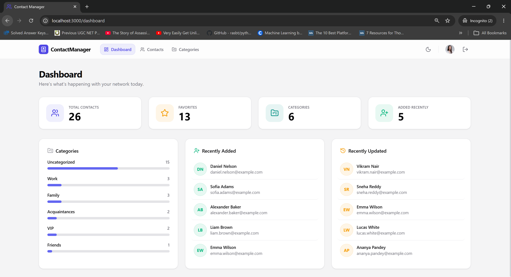 | 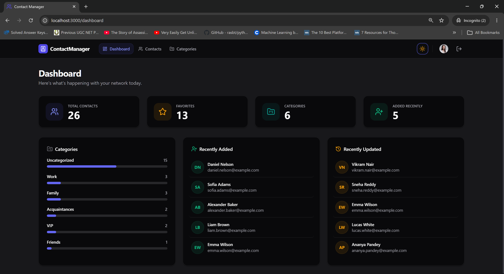 |

### 📇 Contacts Management
*A rich data table featuring pagination, global search, category filtering, favorites toggling, and quick actions.*
| Light Theme | Dark Theme |
|:---:|:---:|
| 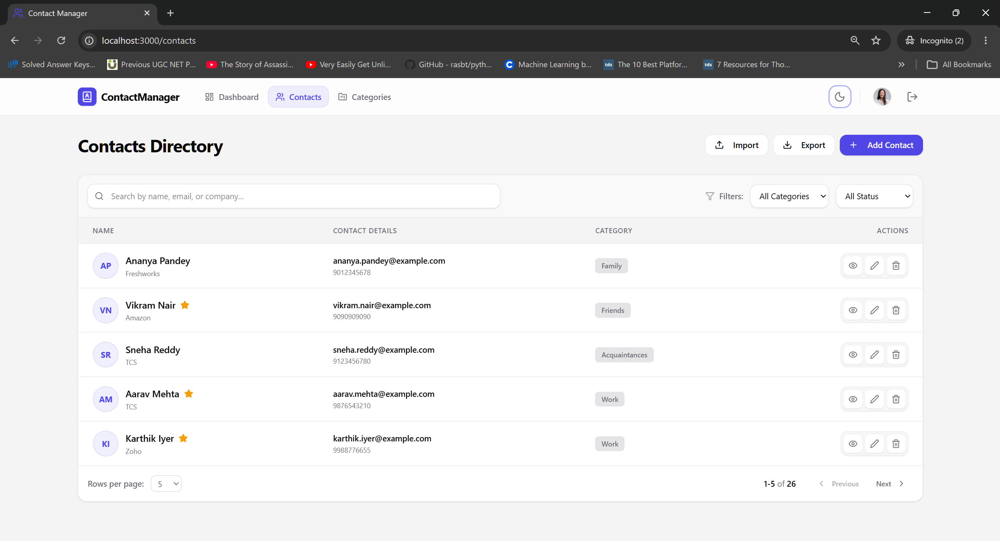 | 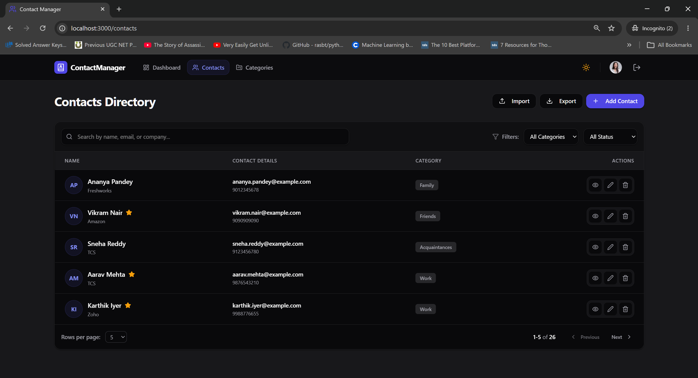 |

### 🏷️ Categories
*Customizable tagging system to group contacts by industry, relationship type, or lead status.*
| Light Theme | Dark Theme |
|:---:|:---:|
| 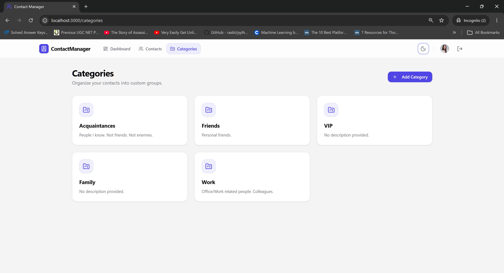 | 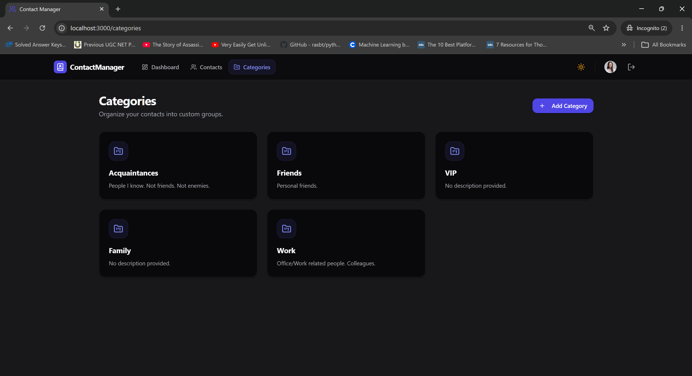 |

### 🔐 Authentication Flow
*Secure, JWT-based authentication featuring login, registration, and secure password recovery.*
| Light Theme | Dark Theme |
|:---:|:---:|
| 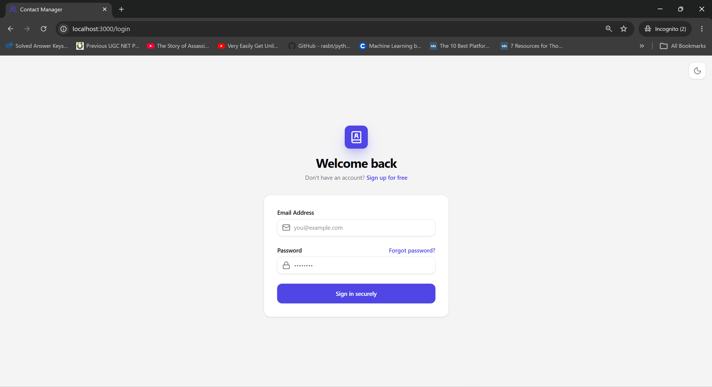 | 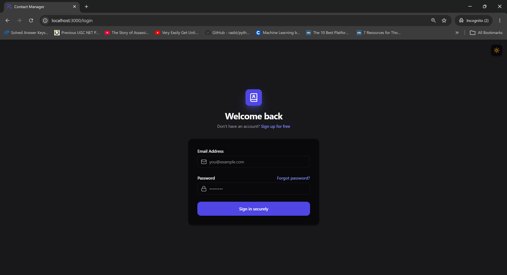 |
| 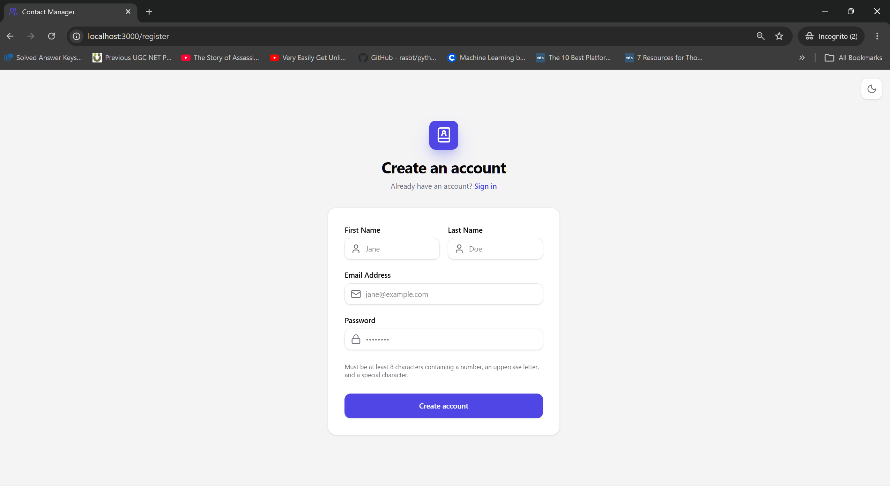 | 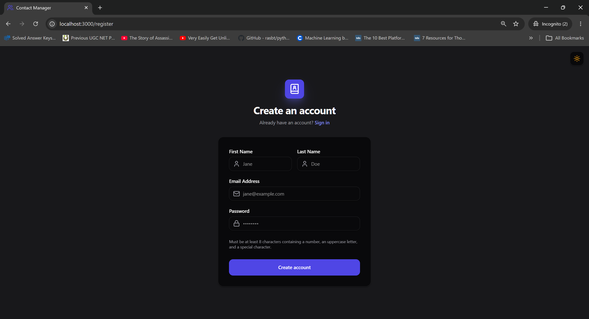 |
| 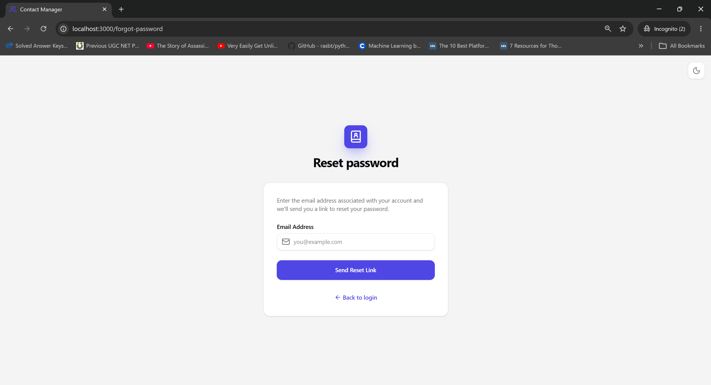 | 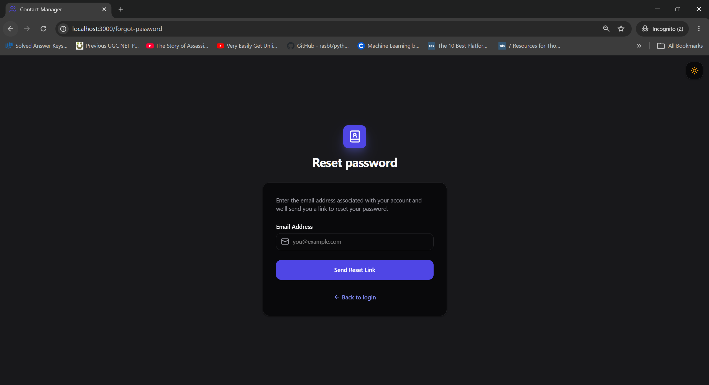 |

### 👤 User Profile
*Account management where users can update their personal details, avatars, and security credentials.*
| Light Theme | Dark Theme |
|:---:|:---:|
| 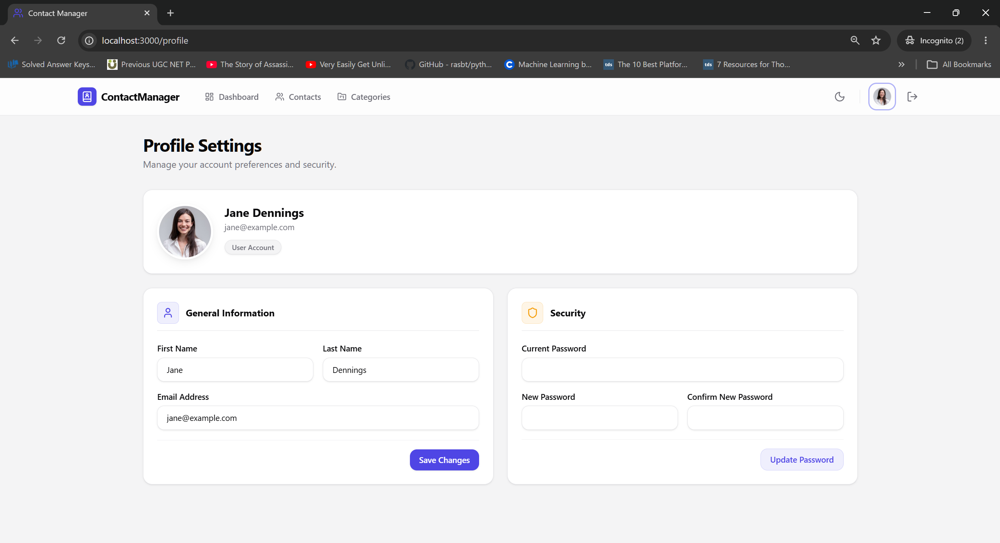 | 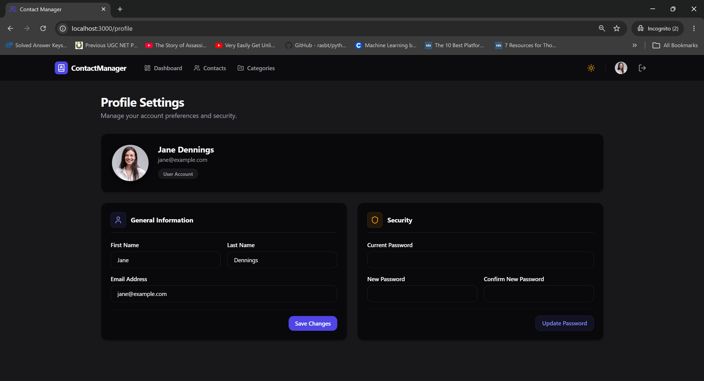 |

## 🔮 Future Improvements / Roadmap

Planned features and improvements:

* [ ] **OAuth Integration**
  Add authentication using Google and GitHub providers.

* [ ] **Analytics Dashboard**
  Add charts and insights to track contact and lead growth.

* [ ] **Role-Based Access Control (RBAC)**
  Allow teams with different permissions such as Admin and Viewer.

* [ ] **Kanban View**
  Add a drag-and-drop pipeline view for managing contacts.

* [ ] **Email Integration**
  Allow users to send emails directly from contact profiles.


## 🤝 Contribution Guidelines

Contributions, bug reports, and feature requests are welcome!

### How to contribute

1. Fork the repository

2. Create a feature branch:

```bash
git checkout -b feature/AmazingFeature
```

3. Commit your changes:

```bash
git commit -m "Add some AmazingFeature"
```

4. Push your branch:

```bash
git push origin feature/AmazingFeature
```

5. Open a Pull Request

---